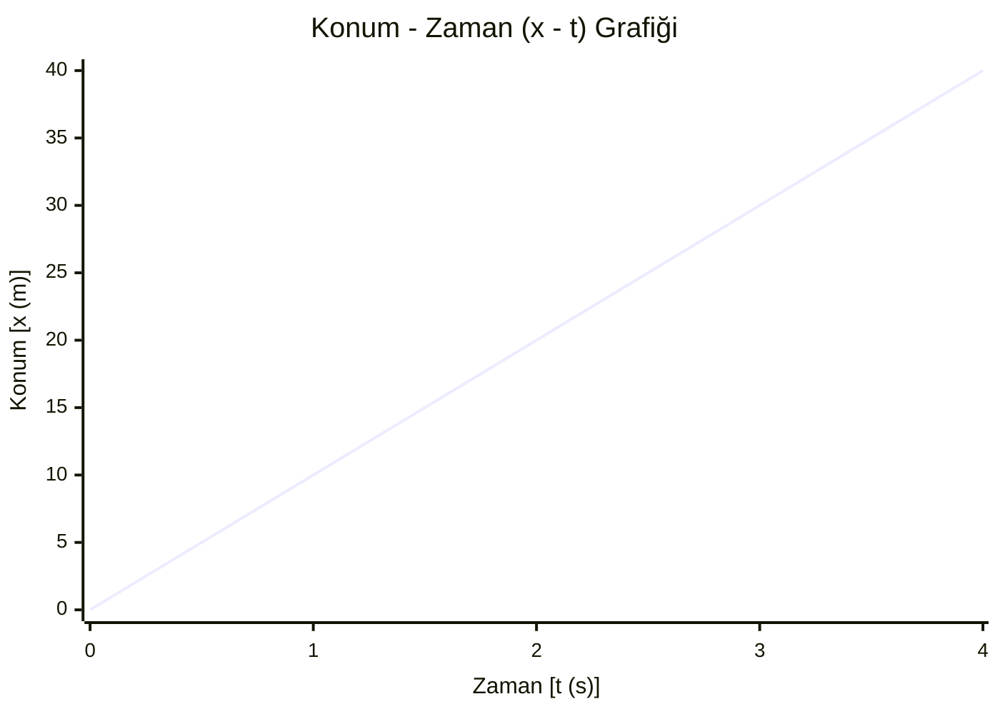

# $$x = v \cdot t$$
- ## **$x$:** Alınan yol (veya yer değiştirme)
    
- ## **$v$:** Hız
    
- ## **$t$:** Zaman
# Sabit hızlı haraket özellikleri:

- Doğrusal bir yolda haraket edilir
- Hareketlerin yönü değişmez
- Haraketlerin konumu zamanla düzgün değişir
- Yön değiştiren cisimler sabit hızlı haraket yapmaz
- Yer değiştirme büyüklükleri aldıkları yola eşit olur
- Alınan yol ya da yer değiştirme büyüklüğü bulunur
---



```mermaid
xychart-beta
    title "Hız - Zaman (v - t) Grafiği"
    x-axis "Zaman [t (s)]" [0, 1, 2, 3, 4]
    y-axis "Hız [v (m/s)]" 0 --> 20
    line [10, 10, 10, 10, 10]
```

| Zaman [t (s)] | Konum [x (m)] | Hız [v (m/s)] | Hareket Durumu               |
| ------------- | ------------- | ------------- | ---------------------------- |
| **0**         | 0             | 10            | Başlangıç anı                |
| **1**         | 10            | 10            | 1. saniye sonunda konum 10 m |
| **2**         | 20            | 10            | 2. saniye sonunda konum 20 m |
| **3**         | 30            | 10            | 3. saniye sonunda konum 30 m |
| **4**         | 40            | 10            | 4. saniye sonunda konum 40 m |
