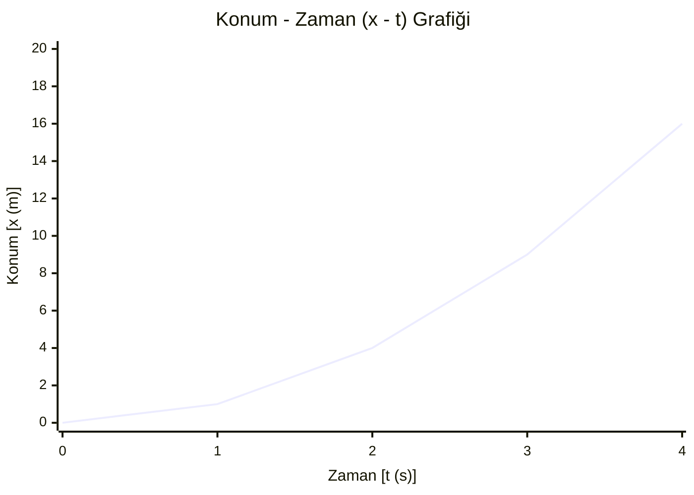

- Birim zamandaki hız değişimidir
- $\vec{a}$ harfi ile gösterilir
- Birimi $m/s^2$ olarak gösterilir 
- Vektörel bir niceliktir
- Doğrusal bir yolda hızlanan yada yavaşlayan araçlarla ivme oluşur
- Araçlar sabit süratle giderken yönünü değiştirirse de ivme oluşur
- Hızlanan yavaşlayan ve yön değiştiren araçların ivmesi vardır
- Doğrusal yolda sabit hızla haraket eden araçların ivmesi sıfırdır
- Duran cisimlerin ivmesi de sıfırdır
- İvme $a = \frac{\Delta v}{\Delta t} = \frac{v_{son} - v_{ilk}}{\Delta t}$ bağlantısıyla bulunur
---

```mermaid
xychart-beta
    title "Hız - Zaman (v - t) Grafiği"
    x-axis "Zaman [t (s)]" [0, 1, 2, 3, 4]
    y-axis "Hız [v (m/s)]" 0 --> 10
    line [0, 2, 4, 6, 8]
```
```mermaid
xychart-beta
    title "İvme - Zaman (a - t) Grafiği"
    x-axis "Zaman [t (s)]" [0, 1, 2, 3, 4]
    y-axis "İvme [a (m/s²)]" 0 --> 5
    line [2, 2, 2, 2, 2]
```
---

| Zaman t (s) | İvme a (m/s²) | Hız v (m/s) | Konum x (m) |
| ----------: | ------------: | ----------: | ----------: |
|           0 |             2 |           0 |           0 |
|           1 |             2 |           2 |           1 |
|           2 |             2 |           4 |           4 |
|           3 |             2 |           6 |           9 |
|           4 |             2 |           8 |          16 |
