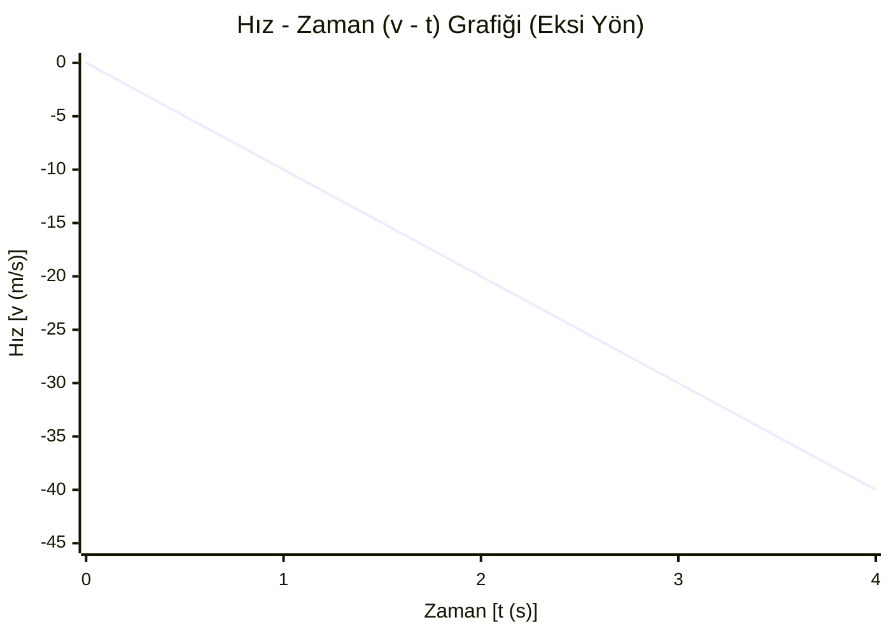
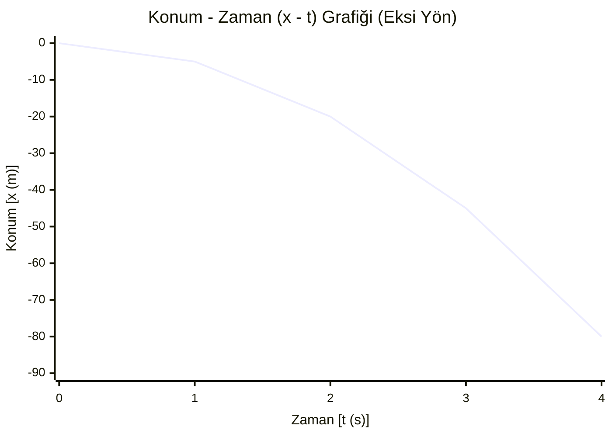

- Hava sürtünmelerinin önemsenmediği ortamda belirli bir yükseklikten serbest bırakılan veya ilk hıza atılan cisimler serbest düşme hareketi yapar
- Serbest düşen cisimlerin tamamı yer çekimi ivmesine sahiptir
- Serbest düşen cisimlerin tamamı yer çekimi kuvveti etkisindedir
 
---
# İlk Hızı Olmayan Serbest Düşme Haraketi
- Hava sürtünmesinin önemsenmediği ortamda belirli bir yükseklikten ilk hızsız serbest bırakılan cisme etki eden net kuvvet yer çekimi kuvveti olur
- F = m . a
- m . g = m . a
- a = g = 10 $m/s^2$ 
- Haraket boyunca ivme eşit olup yer çekimi ivmesi kadardır $g_{k}$ = $g_{l}$ = $g_{m}$ $\approx$ 10 $m/s^2$

---
### **Formüller ($g \approx 10 \text{ m/s}^2$)**

* **Hız Denklemi:** $v = g \cdot t$
* **Yükseklik (Yol) Denklemi:** $h = \frac{1}{2} g t^2$
* **Zamansız Hız Formülü:** $v^2 = 2 g h$

---

 ◯  t = 0s  |  v = 0 m/s   |  h = 0 m   (Başlangıç)
   │
  5m (1h)
   ↓
 ◯  t = 1s  |  v = 10 m/s  |  h = 5 m
   │
  15m (3h)
   ↓
  ◯  t = 2s  |  v = 20 m/s  |  h = 20 m
   │
  25m (5h)
   ↓
  ◯  t = 3s  |  v = 30 m/s  |  h = 45 m
   │
  35m (7h)
   ↓
 ▓▓▓▓▓▓ YER (v = 40 m/s / h = 80 m) ▓▓▓▓▓▓

| Zaman t (s) | İvme g (m/s²) | Hız v (m/s) | Toplam Yükseklik h (m) | Saniye İçi Düşüş (Δh)         |
| :---------: | :-----------: | :---------: | :--------------------: | :---------------------------- |
|    **0**    |      10       |      0      |           0            | Başlangıç anı (Durgun)        |
|    **1**    |      10       |     10      |           5            | 1. saniyede 5 m düştü ($1h$)  |
|    **2**    |      10       |     20      |           20           | 2. saniyede 15 m düştü ($3h$) |
|    **3**    |      10       |     30      |           45           | 3. saniyede 25 m düştü ($5h$) |
|    **4**    |      10       |     40      |           80           | 4. saniyede 35 m düştü ($7h$) |

```mermaid
xychart-beta
    title "İvme - Zaman (a - t) Grafiği (Eksi Yön)"
    x-axis "Zaman [t (s)]" [0, 1, 2, 3, 4]
    y-axis "İvme [a (m/s²)]" -15 --> 0
    line [-10, -10, -10, -10, -10]
```
---

---

