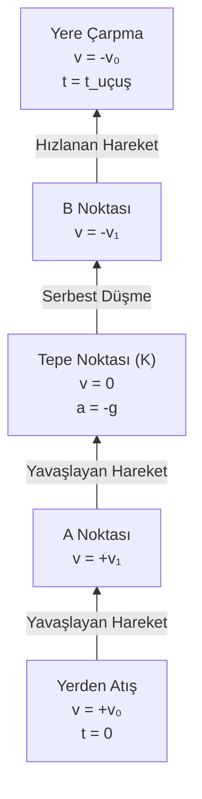
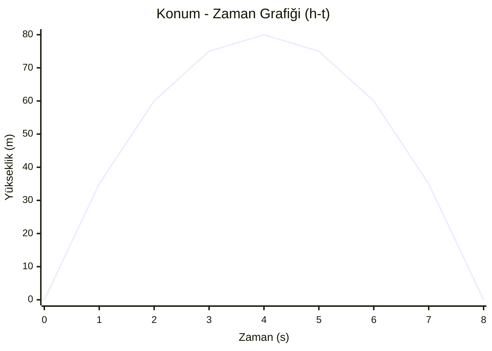

# 01_Fizik - Düşey Yukarı Atış Hareketi

**1. Kuvvet ve İvme Analizi**
Hava sürtünmesinin önemsenmediği ortamda, yerden düşey yukarı $v_0$ ilk hızıyla atılan bir cisme hareket boyunca **sadece yer çekimi kuvveti** etki eder.

* **Net Kuvvet:** $F_{\text{net}} = G = m \cdot g$ (Düşey aşağı yönlü)
* **İvme:** $m \cdot g = m \cdot a \implies a = g \approx 10 \text{ m/s}^2$ (Düşey aşağı yönlü)
* **Altın Kural:** Cisim yukarı çıkarken, tepe noktasındayken ($K$ noktası) veya aşağı inerken ivmesi **hiç değişmez**. İvme vector'ü her an düşey aşağı yönlüdür ($a = -g$).

---

**2. Tepe Noktası ($K$ Noktası) Özellikleri**
Cisim yükseldikçe yer çekimi ivmesi nedeniyle yavaşlar ve tepe noktasına ulaşır:
* **Anlık Hız:** $v_K = 0 \text{ m/s}$ (Cisim anlık olarak durur).
* **İvme:** $a_K = -g \approx -10 \text{ m/s}^2$ (Hızın sıfır olması ivmenin sıfır olduğu anlamına gelmez!).
* **Hareketin Dönüşü:** Tepe noktasından sonra cisim $v_0 = 0$ olan bir **Serbest Düşme Hareketi** yapmaya başlar.
---
![[serbestyukari.png]]

---

**3. Matematiksel Formüller:**

$$t_{\text{çıkış}} = \frac{v_0}{g} \quad \text{ve} \quad t_{\text{uçuş}} = 2 \cdot t_{\text{çıkış}}$$

$$h_{\max} = \frac{v_0^2}{2g} = \frac{1}{2} g t_{\text{çıkış}}^2$$

$$v(t) = v_0 - g \cdot t$$

---

**4. Hareket Diyagramı ve Simetri Özelliği**




**1. Yükseklik (Konum) Denklemi**

$$h = v_0 \cdot t - \frac{1}{2} g t^2$$

**2. Son Hız Denklemi**

$$v = v_0 - g \cdot t$$
**3. Zamansız Hız Denklemi**

Soruda süre ($t$) verilmediğinde hızı veya yüksekliği bulmak için kullanılan temel formül:

$$v^2 = v_0^2 - 2 g h$$
---
### Grafikler

**1. Konum - Zaman Grafiği ($h - t$)**
Cisim yavaşlayarak çıkar, hızlanarak düşer (Parabolik eğri).

---
**2. Hız - Zaman Grafiği ($v - t$)** Hız saniyede $10 \text{ m/s}$ azalır, tepe noktasında sıfırlanır ve negatif yönde artar.
```mermaid
xychart-beta
    title "Hız - Zaman Grafiği (v-t)"
    x-axis "Zaman (s)" [0, 2, 4, 6, 8]
    y-axis "Hız (m/s)" -40 --> 40
    line [40, 20, 0, -20, -40]
```
---
**3. İvme - Zaman Grafiği İçin:**
```mermaid
xychart-beta
    title "İvme - Zaman Grafiği (a-t)"
    x-axis "Zaman (s)" [0, 2, 4, 6, 8]
    y-axis "İvme (m/s²)" -15 --> 5
    line [-10, -10, -10, -10, -10]
```

---
**Grafik Verileri Özeti ($v_0 = 40 \text{ m/s}$)**

| Zaman ($t$) | Konum/Yükseklik ($h$) | Hız ($v$) | İvme ($a$) | Durum / Açıklama |
| :---: | :---: | :---: | :---: | :--- |
| **0 s** | 0 m | +40 m/s | -10 m/s² | Yerden atılış (Başlangıç) |
| **1 s** | 35 m | +30 m/s | -10 m/s² | Yavaşlayarak çıkış |
| **2 s** | 60 m | +20 m/s | -10 m/s² | Yavaşlayarak çıkış |
| **3 s** | 75 m | +10 m/s | -10 m/s² | Yavaşlayarak çıkış |
| **4 s** | **80 m** | **0 m/s** | **-10 m/s²** | **Tepe Noktası ($h_{\max}$)** |
| **5 s** | 75 m | -10 m/s | -10 m/s² | Serbest düşüş (Dönüş) |
| **6 s** | 60 m | -20 m/s | -10 m/s² | Hızlanarak düşüş |
| **7 s** | 35 m | -30 m/s | -10 m/s² | Hızlanarak düşüş |
| **8 s** | 0 m | -40 m/s | -10 m/s² | Yere çarpma anı ($t_{\text{uçuş}}$) |
