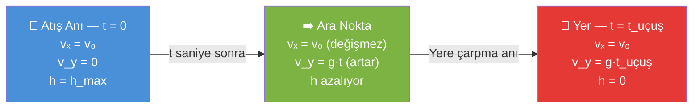
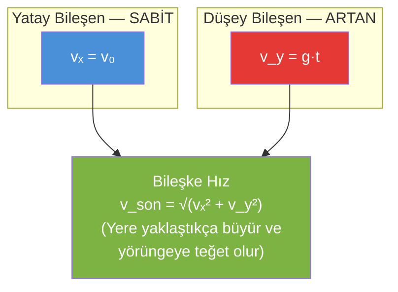
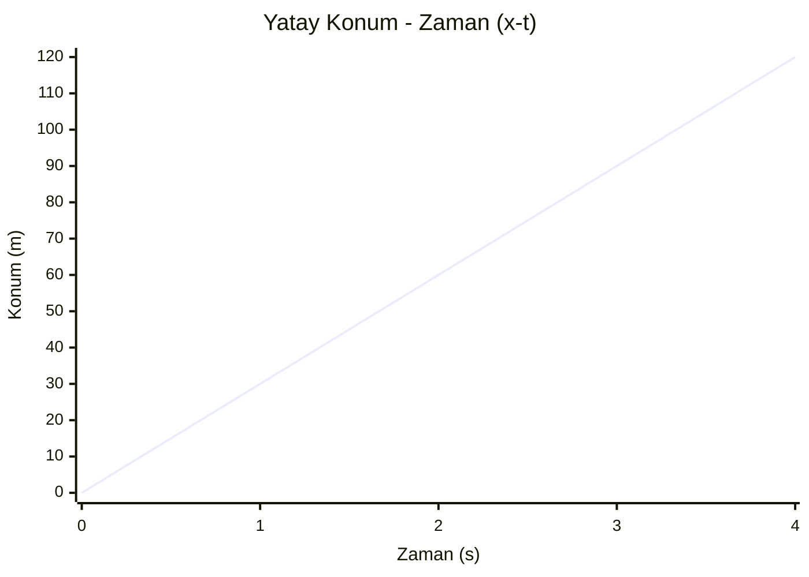
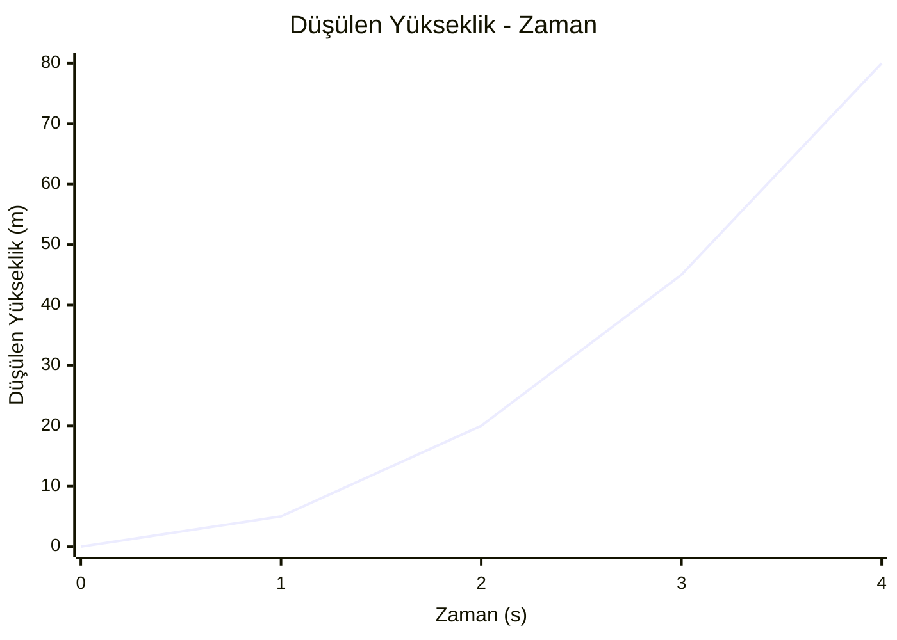
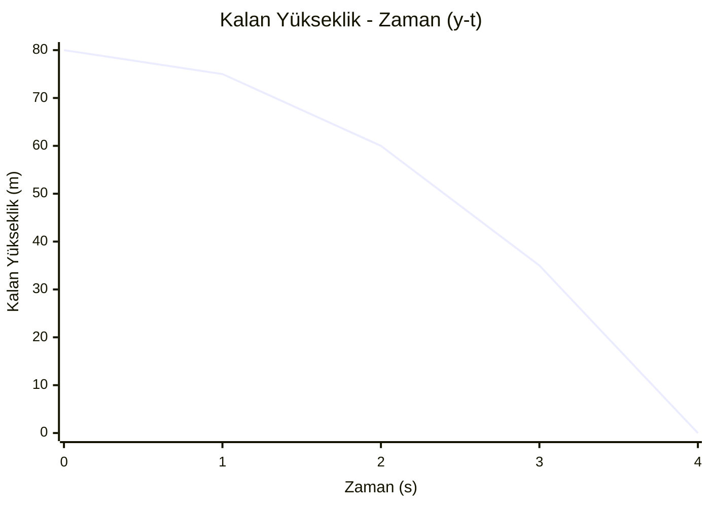

# Yatay Atış Hareketi (Yere Paralel Atış)

## 1. Hareketin Doğası ve Kuvvet Analizi

Yatay atış hareketi, birbiriyle **hiçbir alakası olmayan iki bağımsız hareketin aynı anda** gerçekleşmesidir. Bu duruma **Süperpozisyon İlkesi** denir. Hava sürtünmesi önemsenmediğinde:

| Eksen | Etkiyen Kuvvet | Hareket Türü |
|---|---|---|
| **Yatay (X)** | Yok ($F_x = 0$) | Sabit Hızlı Hareket (ivmesiz) |
| **Düşey (Y)** | Yalnızca yerçekimi ($F_y = m \cdot g$) | Serbest Düşme (ilk hız sıfır) |

> [!info] Önemli
> İki eksendeki hareket birbirinden **tamamen bağımsızdır**. Yatay hız düşey harekete, düşey hız da yatay harekete karışmaz. Cismin havada kaldığı süre ($t_{uçuş}$), **yalnızca düşülen yüksekliğe** bağlıdır; atış hızının büyüklüğü bu süreyi değiştirmez.

---

## 2. Matematiksel Formüller

### Yatay Eksen (Sabit Hızlı Hareket)

$$v_x = v_0 \quad \text{(Hız hiç değişmez)}$$
$$x(t) = v_0 \cdot t \quad \text{(Anlık yatay konum)}$$
$$x_{\max} = v_0 \cdot t_{uçuş} \quad \text{(Menzil)}$$

### Düşey Eksen (Serbest Düşme)

$$v_y = g \cdot t \quad \text{(Düşey hız)}$$
$$h_{düşülen}(t) = \frac{1}{2} g t^2 \quad \text{(Düşülen yükseklik)}$$
$$v_y^2 = 2 g h \quad \text{(Zamansız hız bağıntısı)}$$

### Bileşke (Son) Hız — Pisagor Teoremi

Cismin herhangi bir andaki gerçek hızı, yatay ve düşey hız bileşenlerinin vektörel toplamıdır:

$$v_{son} = \sqrt{v_x^2 + v_y^2}$$

---

## 3. Hareket Yörüngesi Diyagramı



### Hız Vektörünün Değişimi



---

## 4. Grafikler (Örnek: h = 80 m, v₀ = 30 m/s, g = 10 m/s²)

Bu değerlerle uçuş süresi ve son hız çok temiz çıkar (3-4-5 üçgeni):

$$t_{uçuş} = \sqrt{\frac{2h}{g}} = \sqrt{\frac{2 \cdot 80}{10}} = 4 \ s$$
$$x_{\max} = v_0 \cdot t_{uçuş} = 30 \cdot 4 = 120 \ m$$
$$v_{y,son} = g \cdot t_{uçuş} = 10 \cdot 4 = 40 \ m/s$$
$$v_{son} = \sqrt{30^2 + 40^2} = \sqrt{900+1600} = \sqrt{2500} = 50 \ m/s$$

### A. YATAY EKSEN GRAFİKLERİ (Sabit Hızlı Hareket)

Yatay eksende kuvvet olmadığı için **ivme sıfır**, **hız sabit**, **yol-zaman grafiği doğrusal**dır.

**1) Yatay İvme – Zaman ($a_x$–$t$)**

```mermaid
xychart-beta
    title "Yatay İvme - Zaman (ax-t)"
    x-axis "Zaman (s)" [0, 1, 2, 3, 4]
    y-axis "İvme (m/s²)" -5 --> 5
    line [0, 0, 0, 0, 0]
```

**2) Yatay Hız – Zaman ($v_x$–$t$)**

```mermaid
xychart-beta
    title "Yatay Hız - Zaman (vx-t)"
    x-axis "Zaman (s)" [0, 1, 2, 3, 4]
    y-axis "Hız (m/s)" 0 --> 40
    line [30, 30, 30, 30, 30]
```

> [!tip] Alan = Yol
> Bu grafikte eğrinin altında kalan **dikdörtgen alan**, cismin aldığı yatay yolu ($x$) verir: $30 \times 4 = 120\ m$.

**3) Yatay Konum – Zaman ($x$–$t$)**



---

### B. DÜŞEY EKSEN GRAFİKLERİ (Serbest Düşme)

Düşey eksende cisim yerçekimi ivmesiyle hızlanır; ivme **sabit ve g'ye eşit**, hız **doğrusal artar**, düşülen yol ise **zamanın karesiyle** (parabolik) artar.

**1) Düşey İvme – Zaman ($a_y$–$t$)**

```mermaid
xychart-beta
    title "Düşey İvme - Zaman (ay-t)"
    x-axis "Zaman (s)" [0, 1, 2, 3, 4]
    y-axis "İvme (m/s²)" 0 --> 15
    line [10, 10, 10, 10, 10]
```

**2) Düşey Hız – Zaman ($v_y$–$t$)**

```mermaid
xychart-beta
    title "Düşey Hız - Zaman (vy-t)"
    x-axis "Zaman (s)" [0, 1, 2, 3, 4]
    y-axis "Hız (m/s)" 0 --> 40
    line [0, 10, 20, 30, 40]
```

**3) Düşülen Yükseklik – Zaman ($h_{düşülen}$–$t$)**



**4) Yerden Kalan Yükseklik – Zaman ($y$–$t$)**



---

### C. BİLEŞKE (SON) HIZ – ZAMAN GRAFİĞİ

Bileşke hız, yatay hız sabit kalırken düşey hız arttığı için **doğrusal olmayan** (artan eğimli) bir eğri çizer:

| t (s) | vₓ (m/s) | v_y (m/s) | v_son = √(vₓ²+v_y²) |
|---|---|---|---|
| 0 | 30 | 0 | 30.0 |
| 1 | 30 | 10 | 31.6 |
| 2 | 30 | 20 | 36.1 |
| 3 | 30 | 30 | 42.4 |
| 4 | 30 | 40 | **50.0** |

```mermaid
xychart-beta
    title "Bileşke Hız - Zaman (v_son-t)"
    x-axis "Zaman (s)" [0, 1, 2, 3, 4]
    y-axis "Hız (m/s)" 0 --> 55
    line [30, 31.6, 36.1, 42.4, 50]
```

---

## 5. Özet Tablo

| Büyüklük | Yatay Eksen | Düşey Eksen |
|---|---|---|
| Kuvvet | Yok | Yerçekimi ($mg$) |
| İvme | $0$ | $g$ (sabit) |
| Hız | Sabit ($v_0$) | Artan ($g \cdot t$) |
| Konum-Zaman grafiği | Doğrusal | Parabolik |
| Hız-Zaman grafiği | Yatay çizgi | Doğrusal artan |
| İvme-Zaman grafiği | Sıfır çizgisi | Sabit ($g$) çizgisi |

> [!warning] Sık Yapılan Hata
> Uçuş süresini bulurken yatay hızı ($v_0$) kullanmaya çalışmak yanlıştır. Uçuş süresi **yalnızca** düşey harekete (yüksekliğe) bağlıdır: $t_{uçuş} = \sqrt{2h/g}$.
